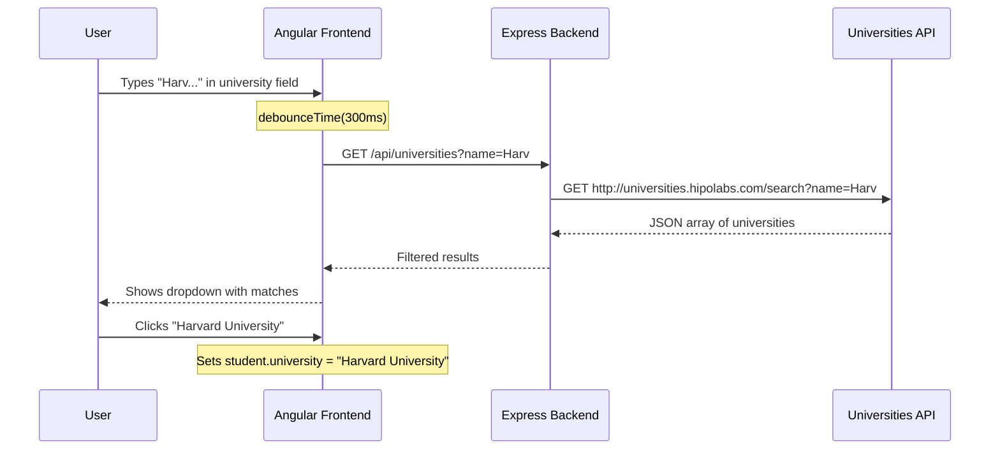

# 🎓 University API Integration Guide

> Step-by-step guide to add a **University autocomplete** field to your Student CRUD app using the [Hipolabs Universities API](http://universities.hipolabs.com/search).

## What You're Building

When a user types in a new "University" field on the Add Student form, the app will:
1. Wait until they've paused typing (debounce)
2. Send their query to your **backend proxy** → which calls the external Universities API
3. Show a **dropdown list** of matching universities
4. Let them click one to auto-fill the field



---

## Overview of Changes

| # | Layer | File | What to do |
|---|-------|------|------------|
| 1 | Backend Model | `backend/src/models/Student.ts` | Add `university` field to schema |
| 2 | Backend Route | `backend/src/routes/university.route.ts` | **[NEW]** Proxy route to call external API |
| 3 | Backend Controller | `backend/src/controllers/university.controller.ts` | **[NEW]** Controller that fetches from Hipolabs |
| 4 | Backend Server | `backend/src/server.ts` | Register the new route |
| 5 | Frontend Model | `frontend/src/app/models/students.ts` | Add `university` to interface |
| 6 | Frontend Service | `frontend/src/app/services/university.ts` | **[NEW]** Angular service to call backend proxy |
| 7 | Frontend Component | `frontend/src/app/components/add-students/add-students.ts` | Add autocomplete logic |
| 8 | Frontend Template | `frontend/src/app/components/add-students/add-students.html` | Add university input + dropdown |
| 9 | Frontend Styles | `frontend/src/app/components/add-students/add-students.css` | Style the autocomplete dropdown |

---

## Step 1 — Update the Backend Student Model

**File:** [Student.ts](file:///c:/Crud/backend/src/models/Student.ts)

**Why:** Your Mongoose schema needs to know about the new `university` field so it gets saved to MongoDB.

**What to do:** Add `university` to both the `IStudent` interface and the `studentSchema`.

```diff
 export interface IStudent extends Document {
     name: string;
     rollNumber: string;
     age: number;
     grade: string;
+    university?: string;    // optional — not every student may have one
 }

 const studentSchema = new Schema<IStudent>({
     name: { type: String, required: true, trim: true },
     rollNumber: { type: String, required: true, unique: true, trim: true },
     age: { type: Number, required: true },
-    grade: { type: String, required: true, trim: true }
+    grade: { type: String, required: true, trim: true },
+    university: { type: String, trim: true }           // not required
 },{
     timestamps: true
 });
```

> [!NOTE]
> We make `university` **optional** (`?` in TypeScript, no `required: true` in Mongoose) so existing students without a university still work fine. Mongoose ignores fields not in the schema, so old data is safe.

---

## Step 2 — Create the Backend University Controller

**File:** [university.controller.ts](file:///c:/Crud/backend/src/controllers/university.controller.ts) **[NEW FILE]**

**Why:** You need a controller that calls the external Hipolabs API. We do this from the **backend** (not the frontend directly) to avoid CORS issues and to keep the external API URL hidden.

**What to create:**

```typescript
import { Request, Response } from 'express';

// 💡 We use Node's built-in fetch (available in Node 18+)
//    No need to install any extra package!

export const searchUniversities = async (req: Request, res: Response): Promise<any> => {
    try {
        // 1️⃣ Get the search query from the request's query string
        const { name } = req.query;

        // 2️⃣ Validate — don't call the external API with an empty query
        if (!name || typeof name !== 'string') {
            return res.status(400).json({ message: 'Query parameter "name" is required' });
        }

        // 3️⃣ Call the external Hipolabs Universities API
        const apiUrl = `http://universities.hipolabs.com/search?name=${encodeURIComponent(name)}`;
        const response = await fetch(apiUrl);

        // 4️⃣ Check if the external API responded successfully
        if (!response.ok) {
            return res.status(502).json({ message: 'Failed to fetch from Universities API' });
        }

        // 5️⃣ Parse the JSON response
        const universities = await response.json();

        // 6️⃣ Send only the first 10 results to keep the response light
        //    Each result has: name, country, domains[], web_pages[], etc.
        const trimmed = universities.slice(0, 10).map((u: any) => ({
            name: u.name,
            country: u.country,
            website: u.web_pages?.[0] || null,
        }));

        return res.status(200).json(trimmed);

    } catch (error) {
        console.error('Error searching universities:', error);
        return res.status(500).json({ message: 'Internal server error' });
    }
};
```

> [!TIP]
> **Key learning — Why a backend proxy?**
> Browsers enforce CORS (Cross-Origin Resource Sharing). The Hipolabs API may not set the right CORS headers for your `localhost:4200` Angular app. By calling it from your Express server (server-to-server), CORS doesn't apply. Your Angular app only talks to `localhost:3000`, which already has CORS configured.

---

## Step 3 — Create the Backend University Route

**File:** [university.route.ts](file:///c:/Crud/backend/src/routes/university.route.ts) **[NEW FILE]**

**Why:** Following the same pattern as your existing [student.route.ts](file:///c:/Crud/backend/src/routes/student.route.ts) — separate route files keep things organized.

**What to create:**

```typescript
import { Router } from 'express';
import { searchUniversities } from '../controllers/university.controller';

const router = Router();

// GET /api/universities?name=harvard
router.get('/', searchUniversities);

export default router;
```

---

## Step 4 — Register the Route in server.ts

**File:** [server.ts](file:///c:/Crud/backend/src/server.ts)

**Why:** Express won't know about your new route until you tell it.

**What to add:**

```diff
 import studentRoutes from './routes/student.route';
+import universityRoutes from './routes/university.route';
 import cookieParser from 'cookie-parser';
```

```diff
 app.use('/students', requireAuth, studentRoutes);
+app.use('/api/universities', requireAuth, universityRoutes);
 app.use('/auth', authRoutes);
```

> [!IMPORTANT]
> Notice we put it behind `requireAuth` — only logged-in users can search universities. This is consistent with how `/students` works. If you want it public (e.g., for testing), remove `requireAuth`.

---

## Step 5 — Update the Frontend Students Interface

**File:** [students.ts](file:///c:/Crud/frontend/src/app/models/students.ts)

**Why:** TypeScript needs to know the `Students` interface now has an optional `university` field.

```diff
 export interface Students {
     name: string;
     rollNumber: string;
     age: number;
     grade: string;
+    university?: string;
 }
```

---

## Step 6 — Create the Frontend University Service

**File:** [university.ts](file:///c:/Crud/frontend/src/app/services/university.ts) **[NEW FILE]**

**Why:** Following your existing pattern (like [student.ts](file:///c:/Crud/frontend/src/app/services/student.ts)) — each resource gets its own Angular service.

**What to create:**

```typescript
import { Injectable } from '@angular/core';
import { HttpClient } from '@angular/common/http';
import { Observable } from 'rxjs';

// 💡 Define an interface for the API response shape
export interface University {
    name: string;
    country: string;
    website: string | null;
}

@Injectable({
    providedIn: 'root',
})
export class UniversityService {
    // Points to YOUR backend proxy, not the external API directly
    private apiUrl = 'http://localhost:3000/api/universities';

    constructor(private http: HttpClient) {}

    // Searches universities by name via your backend proxy
    searchUniversities(name: string): Observable<University[]> {
        return this.http.get<University[]>(this.apiUrl, {
            params: { name },          // Adds ?name=... to the URL
            withCredentials: true,      // Sends the JWT cookie
        });
    }
}
```

> [!NOTE]
> **Pattern match:** Compare this with your [student.ts](file:///c:/Crud/frontend/src/app/services/student.ts) service — same structure: `@Injectable`, `HttpClient`, `withCredentials: true`. Consistency!

---

## Step 7 — Add Autocomplete Logic to the Add Students Component

**File:** [add-students.ts](file:///c:/Crud/frontend/src/app/components/add-students/add-students.ts)

**Why:** This is where the magic happens — RxJS debouncing and autocomplete.

**What to modify — here's the full updated version with explanations:**

```diff
 import { CommonModule } from '@angular/common';
 import { Component } from '@angular/core';
 import { FormsModule, NgForm } from '@angular/forms';
 import { Router } from '@angular/router';
 import { Student } from '../../services/student';
 import { Students } from '../../models/students';
+import { UniversityService, University } from '../../services/university';
+import { Subject } from 'rxjs';
+import { debounceTime, distinctUntilChanged, switchMap, filter } from 'rxjs/operators';
```

```diff
 @Component({
   selector: 'app-add-students',
   imports: [FormsModule, CommonModule],
   templateUrl: './add-students.html',
   styleUrl: './add-students.css',
 })
 export class AddStudents {

   student = {
     name: '',
     rollNumber: '',
     age: 0,
-    grade: ''
+    grade: '',
+    university: ''        // 👈 New field
   };

   errorMessage: string = '';

+  // --- University Autocomplete Properties ---
+  universitySuggestions: University[] = [];   // The dropdown list
+  showSuggestions: boolean = false;           // Controls dropdown visibility
+  private searchSubject = new Subject<string>();  // RxJS Subject for debouncing

-  constructor(private router: Router, private studentService: Student) {}
+  constructor(
+    private router: Router,
+    private studentService: Student,
+    private universityService: UniversityService   // 👈 Inject new service
+  ) {
+    // 🔥 This is the RxJS pipeline — the KEY learning here!
+    this.searchSubject.pipe(
+      debounceTime(300),           // Wait 300ms after user stops typing
+      distinctUntilChanged(),      // Don't search if the text hasn't changed
+      filter(term => term.length >= 2),  // Only search if 2+ characters
+      switchMap(term =>            // Cancel previous request, start new one
+        this.universityService.searchUniversities(term)
+      )
+    ).subscribe({
+      next: (results) => {
+        this.universitySuggestions = results;
+        this.showSuggestions = results.length > 0;
+      },
+      error: () => {
+        this.universitySuggestions = [];
+        this.showSuggestions = false;
+      }
+    });
+  }

+  // Called every time the user types in the university input
+  onUniversityInput(value: string): void {
+    if (value.length < 2) {
+      this.universitySuggestions = [];
+      this.showSuggestions = false;
+      return;
+    }
+    this.searchSubject.next(value);   // Push value into the RxJS pipeline
+  }

+  // Called when user clicks a suggestion
+  selectUniversity(uni: University): void {
+    this.student.university = uni.name;   // Fill the input
+    this.showSuggestions = false;          // Hide dropdown
+    this.universitySuggestions = [];       // Clear suggestions
+  }

   onSubmit(form: NgForm) {
     // ... existing code stays the same ...
   }

   goBack() {
     this.router.navigate(['/students']);
   }
 }
```

> [!IMPORTANT]
> **RxJS Concepts Explained:**
>
> | Operator | What it does | Why you need it |
> |----------|-------------|-----------------|
> | `Subject` | A special Observable you can push values into manually | Bridges the template's `(input)` event to the RxJS pipeline |
> | `debounceTime(300)` | Waits 300ms after the last emission before passing the value through | Prevents firing an API call on every single keystroke |
> | `distinctUntilChanged()` | Only emits if the value is different from the previous one | Avoids duplicate API calls if the user types and deletes the same character |
> | `filter(term => term.length >= 2)` | Only passes values with 2+ characters | Don't waste API calls on single-letter searches |
> | `switchMap(term => ...)` | Subscribes to a new Observable and **cancels** the previous one | If user types "Har" then quickly types "Harvard", the "Har" request is cancelled |

---

## Step 8 — Update the HTML Template

**File:** [add-students.html](file:///c:/Crud/frontend/src/app/components/add-students/add-students.html)

**Why:** Add the university input field with the autocomplete dropdown.

**Where to add it:** After the Grade field (line 63) and before the form-actions div (line 64).

```diff
         </div>  <!-- end of grade form-group -->

+        <!-- 🎓 University Autocomplete Field -->
+        <div class="form-group university-autocomplete">
+            <label for="university">University:</label>
+            <input type="text"
+                id="university"
+                name="university"
+                [(ngModel)]="student.university"
+                (input)="onUniversityInput($any($event.target).value)"
+                (blur)="showSuggestions = false"
+                autocomplete="off"
+                placeholder="Start typing to search universities..."
+                class="form-control">
+
+            <!-- Dropdown list of suggestions -->
+            <ul class="suggestions-list" *ngIf="showSuggestions">
+                <li *ngFor="let uni of universitySuggestions"
+                    (mousedown)="selectUniversity(uni)">
+                    <strong>{{ uni.name }}</strong>
+                    <small>{{ uni.country }}</small>
+                </li>
+            </ul>
+        </div>

         <div class="form-actions">
```

> [!TIP]
> **Why `(mousedown)` instead of `(click)`?**
> The input has a `(blur)` event that hides the dropdown. If you used `(click)`, the `blur` fires first (hiding the dropdown) and the `click` never reaches the `<li>`. `mousedown` fires **before** `blur`, so the selection works!

> [!NOTE]
> **Why `$any($event.target).value`?**
> Angular's strict template type checking doesn't know that `$event.target` is an `HTMLInputElement`. The `$any()` cast tells Angular to trust us. This is a common Angular pattern.

---

## Step 9 — Style the Autocomplete Dropdown

**File:** [add-students.css](file:///c:/Crud/frontend/src/app/components/add-students/add-students.css)

**Why:** The dropdown list needs to be positioned absolutely below the input, styled like a real autocomplete.

**What to add at the end of the file:**

```css
/* === University Autocomplete Styles === */

.university-autocomplete {
    position: relative;    /* 👈 This makes the dropdown position relative to this container */
}

.suggestions-list {
    position: absolute;    /* 👈 Floats over other content instead of pushing it down */
    top: 100%;             /* Right below the parent */
    left: 0;
    right: 0;
    background: white;
    border: 1px solid #ccc;
    border-top: none;
    border-radius: 0 0 4px 4px;
    list-style: none;      /* Remove bullet points */
    padding: 0;
    margin: 0;
    max-height: 200px;
    overflow-y: auto;      /* Scrollable if many results */
    z-index: 10;           /* Float above other elements */
    box-shadow: 0 4px 6px rgba(0, 0, 0, 0.1);
}

.suggestions-list li {
    padding: 10px 12px;
    cursor: pointer;
    display: flex;
    justify-content: space-between;   /* Name on left, country on right */
    align-items: center;
    border-bottom: 1px solid #eee;
}

.suggestions-list li:last-child {
    border-bottom: none;
}

.suggestions-list li:hover {
    background-color: #e9ecef;   /* Highlight on hover */
}

.suggestions-list li strong {
    color: #333;
    font-size: 0.95em;
}

.suggestions-list li small {
    color: #888;
    font-size: 0.85em;
}
```

---

## Complete File Map

After all changes, your file structure will look like this (new files marked with ⭐):

```
backend/src/
├── config/
│   ├── db.ts
│   └── passport.ts
├── controllers/
│   ├── student.controller.ts
│   └── university.controller.ts     ⭐ NEW
├── middleware/
│   └── auth.middleware.ts
├── models/
│   ├── Student.ts                   ✏️ MODIFIED (added university field)
│   └── User.ts
├── routes/
│   ├── auth.route.ts
│   ├── student.route.ts
│   └── university.route.ts          ⭐ NEW
└── server.ts                        ✏️ MODIFIED (registered new route)

frontend/src/app/
├── components/
│   ├── add-students/
│   │   ├── add-students.ts          ✏️ MODIFIED (autocomplete logic)
│   │   ├── add-students.html        ✏️ MODIFIED (university input + dropdown)
│   │   └── add-students.css         ✏️ MODIFIED (dropdown styles)
│   ├── edit-students/
│   ├── login/
│   └── students-list/
├── models/
│   └── students.ts                  ✏️ MODIFIED (added university)
├── services/
│   ├── auth.ts.ts
│   ├── student.ts
│   └── university.ts                ⭐ NEW
└── ...
```

---

## Testing It

### 1. Restart your backend
```bash
cd backend
npm run dev
```

### 2. Test the backend proxy directly
Open a browser or use curl:
```
http://localhost:3000/api/universities?name=harvard
```
You should see a JSON array like:
```json
[
  { "name": "Harvard University", "country": "United States", "website": "http://www.harvard.edu/" },
  ...
]
```

> [!NOTE]
> You'll need to be logged in (have a valid JWT cookie) for this to work since the route is behind `requireAuth`. For quick testing, you can temporarily remove `requireAuth` from the route in `server.ts`.

### 3. Test the full flow
1. Login via Google
2. Go to **Add Student**
3. Type "harv" in the University field
4. Wait ~300ms — a dropdown should appear with "Harvard University" etc.
5. Click a suggestion — it fills the input
6. Submit the form — the student is saved with the university name

---

## What You've Learned 🧠

| Concept | Where you used it |
|---------|-------------------|
| **Backend Proxy Pattern** | Express controller calls external API to avoid CORS |
| **RxJS Subject** | Bridges Angular template events to Observable pipeline |
| **debounceTime** | Prevents API spam while typing |
| **distinctUntilChanged** | Skips duplicate searches |
| **switchMap** | Cancels old requests when new input arrives |
| **filter** | Guards against too-short queries |
| **Autocomplete UX** | `mousedown` vs `click`, `position: absolute` dropdown |
| **Mongoose Schema Extension** | Adding optional fields to an existing schema |
| **Angular Service Pattern** | New service following existing project conventions |

---

## Bonus: Want to Go Further?

Here are ideas to extend this feature:

1. **Show a loading spinner** while the API is being called (add an `isSearching` boolean)
2. **Add the university field to the Edit Student page** too (same pattern as Add)
3. **Display university in the Students List table** (add a column)
4. **Filter by country** — the Hipolabs API supports `?country=India` parameter
5. **Cache results** — if the user searches "Har", then "Harv", you already have the "Har" results — filter locally first
